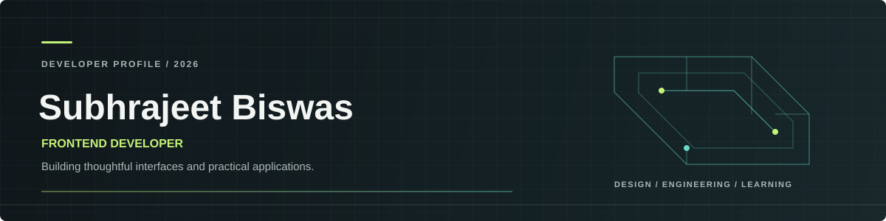

  

  <a href="https://official-portfolio-beryl.vercel.app">Portfolio</a>
  &nbsp; / &nbsp;
  <a href="https://www.linkedin.com/in/subhrajeet-biswas-79a415237">LinkedIn</a>
  &nbsp; / &nbsp;
  <a href="https://github.com/subh-ui">GitHub</a>

## About

Frontend-focused developer creating responsive web experiences and practical applications. I enjoy turning ideas into clear interfaces and learning by building. Currently expanding toward full-stack development with JavaScript, PHP, Python, and MySQL.

## Selected Work

| Project | Overview | Built with |
|:--|:--|:--|
| [WorkNest](https://github.com/subh-ui/WorkNest) | Job portal connecting job seekers with hiring teams, with tools for managing roles and applicants. | PHP |
| [Shanaya](https://github.com/subh-ui/Shanaya) | Virtual assistant project. | Python |
| [Personal Portfolio](https://github.com/subh-ui/Official-Portfolio) | Personal portfolio website. [Live site](https://official-portfolio-beryl.vercel.app) | JavaScript |

## Toolkit

**Frontend**

HTML · CSS · JavaScript

**Languages and tools**

Python · PHP · MySQL · C · Java · Git · GitHub

## Connect

[LinkedIn](https://www.linkedin.com/in/subhrajeet-biswas-79a415237) · [Instagram](https://www.instagram.com/subhrajeet_207)